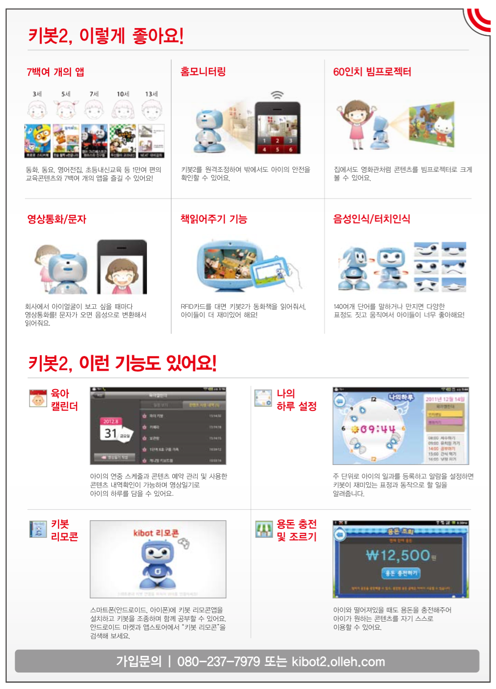
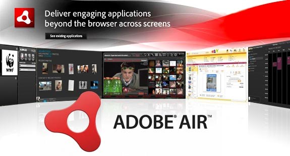

# 키봇 ADOBE AIR 포팅

IRIVER 에서 제작하고 KT 가 판매를 맡은 키봇은 유아용 교육 로봇입니다. 

[유투브 동영상보기](https://www.youtube.com/watch?v=PXIi_okbaBg)

## 컨텐츠 실행 환경 ADOBE AIR

키봇에는 교육, 육아 캘린더, 영상통화 등등 매우 다양한 컨텐츠가 있습니다. 그리고 키봇에서 동작하는 컨텐츠의 대부분은 ADOBE AIR 플랫폼 위에서 실행됩니다. 

Adobe AIR 는 기본적으로 영상 처리를 위해 소프트웨어 코덱을 사용합니다. 하지만 소프트웨어 코덱을 사용하면 성능상 매우 불리해집니다. 

교육용 컨텐츠 하나를 보는데도 애니메이션이 끊긴다면 어떤 아이가 이 로봇을 좋아할수가 있을까요?

이 문제를 해결하기 위해서는 Adobe AIR 플랫폼을 키봇 하드웨어에 맞게 포팅하여 하드웨어 가속을 사용할 수 있게 해주어야 합니다.

키봇의 대부분의 컨텐츠는 Adobe AIR 에서 동작하는 Action Script 로 이루어져 있으므로 하드웨어 가속 포팅은 핵심 작업 중 하나였습니다. 

## EgoDev 팀의 역할

저희 팀은 키봇이 개발될 때 주식회사 파인원 커뮤니케이션즈 소속으로 Adobe AIR 포팅을 진행 하였습니다. 

키봇이  그래픽 작업에서 하드웨어 가속을 사용할 수 있도록 한것이죠. 키봇이 아이들에게 사랑받을 수 있는데에 하나의 큰 축을 해결한 셈입니다.

## 사용 언어 및 기술

* C / C++
* JAVA
* JNI
* Android
* Adobe AIR
* H264
